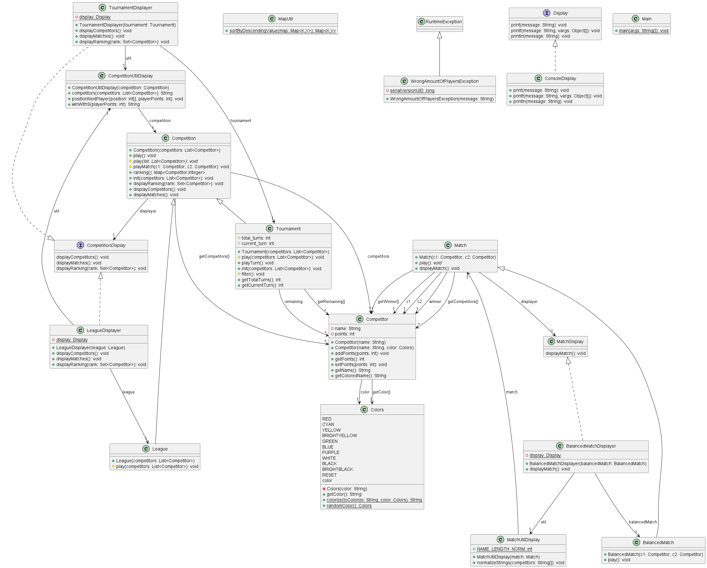
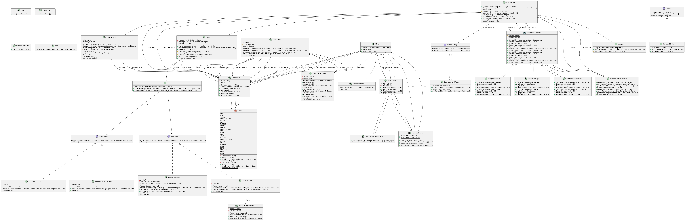
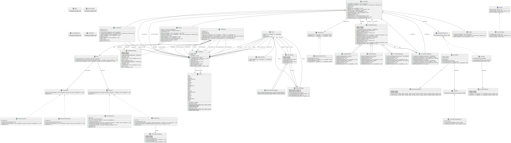

# Projet de COO

## Table of contents

- [Projet de COO](#projet-de-coo)
  - [Table of contents](#table-of-contents)
  - [Binôme](#binôme)
  - [Points importants du Projet](#points-importants-du-projet)
    - [Livrable 1](#livrable-1)
    - [Livrable 2](#livrable-2)
    - [Livrable 3](#livrable-3)
  - [HowTo](#howto)
    - [Compilation des classes et des tests](#compilation-des-classes-et-des-tests)
    - [Exécution du main du premier livrable (competitions)](#exécution-du-main-du-premier-livrable-competitions)
    - [Exécution du main du deuxième livrable (master)](#exécution-du-main-du-deuxième-livrable-master)
    - [Exécution du main du troisième livrable (observer)](#exécution-du-main-du-troisième-livrable-observer)
    - [Exéctution des Tests](#exéctution-des-tests)
    - [Création des Jar](#création-des-jar)
    - [Lancement du Jar du premier livrable (competitions)](#lancement-du-jar-du-premier-livrable-competitions)
    - [Lancement du Jar du deuxième livrable (master)](#lancement-du-jar-du-deuxième-livrable-master)
    - [Lancement du Jar du troisième livrable (observer)](#lancement-du-jar-du-troisième-livrable-observer)
    - [Génération de la Documentation](#génération-de-la-documentation)
      - [Clean](#clean)

## Binôme

Dubuisson Samuel  
Taffin Tom

## Points importants du Projet

### Livrable 1

>Competition

La classe `Competition` est la classe qui s'occupe de l'organisation des matchs et de la gestion des compétiteurs. Cette classe est une classe abstraite et peut être étendue par des types précis de compétition. Elles redéfiniront ainsi la méthode `play()` qui définit le comportement de la compétition et comment elle décide d'appeler les matchs. Nous avons pour l'instant une classe `Tournament` et une classe `League` qui en héritent. Il sera ainsi assez simple d'ajouter de nouveaux types de compétitions à l'avenir (Principe OCP). Lors de l'appel de la méthode `play()`, les compétitions peuvent lancer une exception si le nombre de compétiteurs n'est pas conforme (exemple: une compétition à 0 participant).  
Les affichages relatifs à la compétition seront gérés par des classes spécifiques, dans le package display (principe SRP).

>Match

Notre hiérarchie pour les matchs est la suivante : nous avons une classe `Match` abstraite qui définit le match, et permet aux classes qui en descendent de redéfinir la méthode `play()` qui décide du vainqueur du match. Pour le moment nous avons simplement la classe `BalancedMatch` qui donne une chance égale aux deux compétiteurs de l'emporter. Comme pour les compétitions, l'ajout de nouveaux types de match est facilement envisageable (Principe OCP).

>Display

Nous avons également mis en place un système d'affichage. Premièrement nous avons défini une interface `Display` qui annoncent des fonctions de base d'affichage (`print`, `printf`, `println`). Diverses classes pourront l'implémenter, ce qui pourra permettre plus tard de modifier facilement l'afficheur (une interface graphique serait par exemple implémentable).  
Pour le moment nous avons une classe `ConsoleDisplayer` qui l'implémente. Elle définit ces fonctions à l'aide de `System.out` et affiche donc dans la console. Les diverses classes Displayer ont donc un attribut `Display` pour permettre l'affichage (abstraction de haut niveau et principe DIP).  
Les classes concrètes du projet qui peuvent être amenées à afficher quelquechose ont leur propre classe Displayer. Chaque groupe de displayers implémente une interface qui annonce les méthodes qu'elles utiliseront (Principe ISP). Par exemple, pour les compétitions, nous avons un `TournamentDiplsayer` ainsi qu'un `LeagueDisplayer`. Chacune implémente l'interface `CompetitionDisplay`, qui définit les fonctions qui pourront être utilsées par chacune (`displayCompetitors` pour l'introduction, `displayMatches` pour l'annonce d'un groupe de matchs, et `displayRanking` pour le classement et la conclusion).  
Ainsi, notre classe abstraite Competition utilise un displayer de type `CompetitionDisplay`. Cela permet une abstraction de haut niveau (principe DIP), ce qui nous évite par exemple des problèmes de casts répétitifs que l'on aurait pu avoir en utilisant ici une hiérarchie de classes (principe LSP). Nous avons préféré passer les méthodes utiles aux displayers de compétitions dans une classe `CompetitionUtilDisplayer`.

### Livrable 2

>Master

La classe `Master` est une classe qui hérite de `Competition`, et qui s'occupe de l'ogranisation de poules et d'une phase finale. Cette classe fait appel à une règle `Rule` composée d'un `groupMaker` et d'un `Selection` qui permettront de séparer les joueurs en poules puis d'en sélectionner pour la phase finale. Nous avons fait le choix d'utiliser des classes déjà existantes, `League` et `Tournament`, pour éxecuter respectivement les poules et la phase finale. Le ranking du `Master` renvoie le classement de la phase finale avec les joueurs concernés, et les classements des différentes poules sont affichés lors de l'exécution du `Master` et sont stockés dans les différentes `League` correspondantes à chaque poule.

>Match

Nous avons profité de la création d'un nouveau type de compétition pour apporter de la flexibilité au niveau des types de match. Nous avons mis en place un design pattern factory pour les matchs. Par défaut les matchs restent des `BalancedMatch`, mais on pourra, à la création d'une compétition, indiquer une `FactoryMatch` qui définira les matchs à créer (compétitions avec des matchs différents, types de matchs qui dépendent des joueurs, etc).

>Rule

La classe `Rule` est composée de deux interfaces appelées `GroupMaker` et `Selection` : `GroupMaker` s'occupe de déclarer les méthodes permettant de diviser les joueurs en poules, qui seront définies dans toutes les classes qui l'implémenteront, tandis que le rôle de `Selection` est de déclarer les méthodes permettant de sélectionner des joueurs dans les poules pour la phase finale, qui seront aussi définie par les classes qui l'implémenteront. Nous pourrions donc par exemple avoir des rules prédéfinies qui seront utilisables par différents `Master`. Si à partir de sa `Rule` et des compétiteurs, le `Master` n'obtient pas un nombre de joueurs égal à une puissance de 2 pour sa phase finale, il lancera une erreur à la fin des poules. On pourrait imaginer d'autres types de `Master` qui "repêcheraient" par exemple des compétiteurs pour tomber sur une puissance de 2.

>GroupMaker

Deux différentes implémentations de `GroupMaker` sont proposées. La première `NumberOfGroups` prend dans son constructeur un entier correspondant au nombre de groupes à créer, tandis que la seconde `NumberOfCompetitors` prend dans son constructeur un entier correspondant au nombre de joueurs par groupe (la classe s'occupe donc de calculer le nombre de groupes à créer). Nous avons donc 2 approches assez flexibles qui permettent à l'utilisateur de créer les groupes qui conviennent.  
Il a été décidé que les groupMaker seraient *flexibles*. Si les modulos ne tombent pas juste et qu'il y a des joueurs en trop par rapport à ce qui est attendu, ils seront répartis dans les groupes restants. En revanche, si le nombre de joueurs est inférieur au nombre attendu (par exemple des groupes de 6 compétiteurs avec seulement 3 compétiteurs), nous lançons une exception.

>Selection

Deux différentes implémentations de `Selection` sont également proposées. La première `RankSelector` prend dans son constructeur un entier correspondant au nombre de compétiteurs à sélectionner dans chaque groupe. Si ce paramètre est égal à x, les x premiers de chaque poule seront sélectionnés. Ceci nous laisse déjà imaginer t selecteurs différents, où t est la taille des poules.  
Nous avons ensuite une seconde implémentation `PositionSelector`, qui elle permet une sélection plus précise. Elle prendra dans son constructeur un paramètre sous forme de tableau qui définira le nombre de joueurs à sélectionner pour chaque place. Nous souhaitions au début partir sur une table de hachage `<Integer, Integer>` (où la clé correspond à la place, et la valeur au nombre de joueurs à sélectionner à cette place), mais avec des clés et des valeurs sous forme d'entiers, il est plus simple d'utiliser un tableau. La valeur à l'indice i correspond au nombre de joueurs à sélectionner à la place i+1.  
Par exemple le tableau suivant : [4,2,0,1] signifie qu'on sélectionne les 4 meilleurs premiers, les 2 meilleurs seconds, aucun troisième et un quatrième.  
Il peut cependant y avoir des problèmes d'égalité pour des places qualificatives. Au lieu de laisser cela au hasard, nous avons décidé de créer des tie-breakers.  
Pour chaque position nous avons donc (n+1) possibilités de sélection, où n est le nombre de groupes (de 0 jusqu'à n sélectionnés), et t positions, où t est la taille des groupes. Ce qui nous fait n*t `PositionSelector` différents.  
Si on additione cela au RankSelector, nous avons t + (n+1)*t selecteurs différents possibles.

>TieBreaker

La classe de départages `TieBreaker` permet de choisir entre plusieurs participants ex-aequo pour une même place qualificative. Elle va lancer une `League` avec les joueurs concernés par le départage. Si les joueurs sont départagés à la première `League`, le travail de la classe s'arrête là. Si des joueurs sont encore à égalité et en concurrence pour la même place qualificative, la classe `TieBreak` se charge de lancer une nouvelle `League`, avec les joueurs encore à égalité. Ce procédé est effectué jusqu'à ce que les joueurs soient départagés, ou bien jusqu'à ce qu'on ait atteint un certain nombre d'itérations (appelé `remainings` dans le code). Si ce nombre est atteint on fait un départage final, où nous auront forcément des vainqueurs désignés. Pour être sûr de ne plus avoir d'égalité, nous pouvons imaginer un pile ou face, lancé de dé, mais pour rester dans l'esprit de compétition, nous faisons disputer une épreuve des poteaux de Koh-Lanta, où les derniers à rester sur leur poteau sont les sélectionnés.  
Nous avons opté pour l'affichage de ces phases de départages, avec une nouvelle classe de `Display`. Nous avons ajouté un booléen `display` dans cette classe pour informer s'il faut ou non afficher les tie-breaks. Si par le futur, nous avons des compétitions trop conséquentes, avec beaucoup d'affichages, nous pourrions masquer certains tie-breaks pour alléger la présentation.

>Display

Pour les displayers nouvellement créés (principalement dans le package `rules`), la même logique d'organisation des classes a été utilisée que pour le livrable précédent. Ensuite, dans les classes affichant le déroulement des compétitions, nous avons opté pour une nouvelle conception de celles-ci : en effet, désormais il existe une classe centralisant et généralisant toutes les méthodes nécessaires pour chaque domaine du projet (une classe `CompetitionDisplay` pour les compétitions, une classe `MatchDisplay` pour les matchs), et chaque classe associée à la classe qu'elle doit afficher devra hériter de cette super-classe tout en apportant la particularité visuelle de chacune. Cela évite ainsi la duplication de code existante auparavant.

### Livrable 3

  

>CompetitionObserver

Une interface CompetitionObserver a été créée pour désigner ceux qui observent les matchs dans les compétitions

>Journalist

Le Journalist utilise une liste de phrases aléatoires pour ses commentaires.

>Bookmaker

Le Bookmaker utilise des algorithmes spécifiques pour le calcul. Afin de pouvoir facilement changer les algorithmes, nous avons opté pour un template pattern.

>Algorithm

Pour le calcul des côtes, nous avons préféré élaborer un algorithme qui calcule les côtes différement en fonction de la côte du joueur et de la côte de son adversaire. Un joueur dont l'adversaire a une côte très éloignée de la sienne perdra moins de points que s'ils avaient une côte similaire. Un joueur avec une côte très basse aura un faible coefficient de changement (exemple : un joueur à côte 1.5 gagnera quelques dixièmes/centièmes de points en cas de victoire, alors qu'un joueur à une côte de 50 pourra gagner plusieurs points d'un coût avec une victoire). 
D'ailleurs nos côtes s'échelonnent de 1 (la côte n'atteint jamais cette valeur, mais s'en rapproche autant que possible avec les victoires), sans borne supérieure.

>Tests

Des Mocks ont notamment été créés pour tester que le pattern observer fonctionnait correctement (en vérifiant que le nombre d'appels correspond au nombre de matchs joués).

>Displayer

Grâce à notre précédente implentation de Displayer, il a suffit de créer 2 nouvelles classes pour Journalist et BookMaker, pour avoir un Displayer fonctionnel.

## HowTo

>**Il faut exécuter les commandes suivantes à la racine du projet:**

### Compilation des classes et des tests

`make cls`  
Les classes compilées seront dans un dossier classes

### Exécution du main du premier livrable (competitions)

`make competition`

### Exécution du main du deuxième livrable (master)

`make master`

### Exécution du main du troisième livrable (observer)

`make observer`

### Exéctution des Tests

`make tests`

### Création des Jar

`make jarfile`

### Lancement du Jar du premier livrable (competitions)

`make runcompetition`

### Lancement du Jar du deuxième livrable (master)

`make runmaster`

### Lancement du Jar du troisième livrable (observer)

`make runobserver`

### Génération de la Documentation

`make docs`  
Les documentations seront localisées dans un dossier docs/

#### Clean

Pour supprimer les dossiers et fichiers nouvellement créés (les classes compilées, les docs générés, etc), il faut entrer la commande:  
`make clean`
